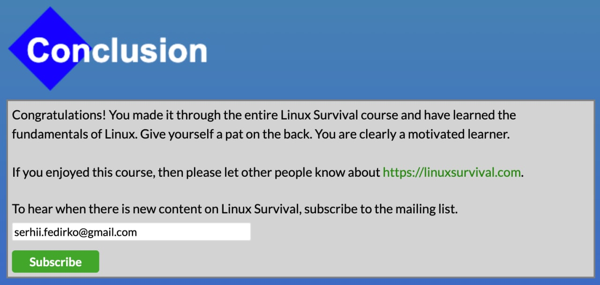

# Kottans frontend
Kottans FE course to refresh knowledge.

First chapter about Git was quite interesting, because usually I do all the versioning via GUI (in PHPStorm), and here I have used just terminal, so was able to remember all the commands :)

## Linux CLI, and HTTP

So, I just survived Linux. Again :)

It was nice to recall some commands (like about groups or members). Most of this commands are often used in a daily work when need to do something directly on the server.  

